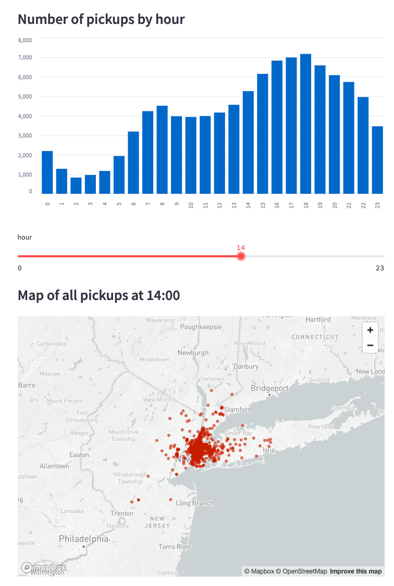

# Web GUI

[TOC]

## Warum Streamlit?

Eine Web User Interface (Web UI) ist die Schnittstelle, die es Benutzern ermöglicht, mit einer Webanwendung oder Website zu interagieren. Sie besteht aus verschiedenen Elementen wie Schaltflächen, Textfeldern, Menüs und anderen grafischen Komponenten, die Benutzereingaben akzeptieren und Informationen darstellen.

In Python gibt es mehrere Frameworks und Bibliotheken, mit denen Entwickler Web UIs erstellen können. Hier sind einige der bekanntesten:

1. **Django** ist ein umfassendes Webframework für Python, das eine eingebaute Unterstützung für die Erstellung von Webanwendungen bietet. Es enthält ein eigenes Template-System für die Erstellung von Web UIs und ermöglicht die Verwendung von Python-Code, um die Benutzeroberfläche zu gestalten und zu verwalten. Django bietet auch Sicherheitsfunktionen und eine ORM (Object-Relational Mapping)-Schicht zur Datenbankinteraktion.
2. **Flask** ist ein leichtgewichtiges Webframework für Python, das Entwicklern die Freiheit gibt, ihre Web UIs nach ihren eigenen Vorstellungen zu gestalten. Flask ist nicht so umfangreich wie Django, bietet jedoch die Flexibilität, verschiedene Bibliotheken und Technologien für die Gestaltung von Web UIs zu verwenden.
3. **FastAPI** ist ein modernes Webframework, das auf schnelle Entwicklung und einfache Handhabung von APIs abzielt. Es eignet sich gut für die Erstellung von RESTful APIs, aber Sie können auch Web UIs mit Template-Engines wie Jinja2 erstellen, wenn Sie dies wünschen.
4. **Tornado** ist ein Framework für die Erstellung von skalierbaren und nicht blockierenden Webanwendungen. Obwohl es hauptsächlich für Websockets und asynchrone Anwendungen entwickelt wurde, kann es auch zur Erstellung von Web UIs verwendet werden.
5. **Streamlit** hingegen ist eine Bibliothek, die speziell für die einfache Erstellung von interaktiven Web UIs für datengesteuerte Anwendungen entwickelt wurde. Es ist besonders nützlich für Datenanalysen und -visualisierungen.

Wir wollen uns in diesem Lab primär mit Web UI-Frameworks wie Streamlit befassen und weniger mit "vollwertigen" Webframeworks wie Django, Flask, FastAPI oder Tornado, die eher in REST APIs oder vollumfänglichen Webanwendungen ihre Stärken ausspielen können, dafür aber auch mit einiger Komplexität einhergehen. Ferner müssen Sie mit Tools wie Streamlit weniger Einblick in Technologien wie JavaScript, HTML und CSS haben, da Ihnen diese Frameworks viel derartige Komplexität kapseln.

[Streamlit](https://streamlit.io) ist eine Open-Source-Python-Bibliothek, die es Entwicklern ermöglicht, interaktive Webanwendungen und Dashboards für Datenvisualisierung und -analyse zu erstellen, ohne umfangreiche Webentwicklungsfähigkeiten zu benötigen. Mit Streamlit können Sie schnell und einfach datengetriebene Anwendungen erstellen, indem Sie Python-Code verwenden, um Benutzeroberflächen zu erstellen, Daten zu verarbeiten und Visualisierungen zu generieren.

- Mit Streamlit können Entwickler **interaktive Anwendungen** in wenigen Zeilen Python-Code erstellen. Sie müssen sich nicht um HTML, CSS oder JavaScript kümmern, da Streamlit diese Aufgaben für Sie erledigt.
- Streamlit ist besonders gut geeignet, um schnell **Prototypen** von Datenanalysen oder -visualisierungen zu erstellen. Sie können sofort Änderungen vornehmen und sehen, wie sich diese auf Ihre Anwendung auswirken.
- Streamlit unterstützt die Integration von verschiedenen Python-Bibliotheken für **Datenvisualisierungen** wie Matplotlib, Plotly, Altair und Bokeh. Dies ermöglicht es Ihnen, Diagramme und Grafiken in Ihre Anwendungen einzufügen.
- Sie können die üblichen **GUI-Widgets** wie Schieberegler, Auswahllisten und Texteingabefelder verwenden, um Benutzereingaben zu erfassen und die Anwendung interaktiv zu gestalten.
- Sobald Sie Ihre Streamlit-Anwendung erstellt haben, können Sie sie leicht über einen **Webbrowser** nutzen.

Streamlit ist besonders nützlich für Datenwissenschaftler, Ingenieure und Entwickler, die schnell prototypische Nutzeroberflchen, Datenvisualisierungen oder -analysen erstellen und sie mit anderen teilen möchten. Es bietet eine einfache Möglichkeit, datengesteuerte Anwendungen ohne viel Aufwand als Web-Anwwendungen bereitzustellen.

## Aufgabe 1: Einarbeitung in Streamlit

- [Installation](https://docs.streamlit.io/get-started/installation) von Streamlit
- Arbeiten Sie sich in die [Kernkonzepte](https://docs.streamlit.io/get-started/fundamentals/main-concepts) von Streamlit ein
- Arbeiten Sie sich in die [erweiterte Konzepte](https://docs.streamlit.io/get-started/fundamentals/advanced-concepts) wie Caching und Session State in Streamlit ein
- Bringen Sie diese Erkenntnisse in einer stichpunktartigen [Zusammenfassung](https://docs.streamlit.io/get-started/fundamentals/summary) auf den Punkt.

> Bearbeiten Sie dieses Repository als reguläre Aufgabe im Rahmen eines Moduls mit wöchentlichen Moodle-Tests, können die Inhalte dieser Links durch den wöchentlichen Test abgeprüft werden.

## Aufgabe 2: Entwickeln Sie Ihre erste Streamlit-App

Für diese Aufgabe installieren Sie bitte auf Ihrem Rechner:

- [Python](https://www.python.org/downloads/)
- [Visual Studio Code](https://code.visualstudio.com) inkl. der [Python Extension](https://marketplace.visualstudio.com/items?itemName=ms-python.python)

[Uber](https://www.uber.com) ist ein multinationales Technologieunternehmen, das ursprünglich im Jahr 2009 gegründet wurde und seinen Hauptsitz in San Francisco, Kalifornien, hat. Das Unternehmen ist vor allem für seine Ride-Sharing-Plattform und seine On-Demand-Fahrdienste bekannt.

Auf Basis dieser [Daten von Abholungen](https://s3-us-west-2.amazonaws.com/streamlit-demo-data/uber-raw-data-sep14.csv.gz) sollen Sie nun im Lab eine Streamlit-Anwendung erstellen, die Uber "Pickups" auf einer Karte von New York City visualisiert.

Unter einem "Pickup" verstehen wir dabei, dass ein registrierter Uber-Fahrer einen Passagier an einem bestimmten Ort abholt und zu seinem gewünschten Ziel fährt.

Arbeiten Sie dazu bitte folgendes [Tutorial](https://docs.streamlit.io/get-started/tutorials/create-an-app) durch. Ihre Anwendung sollte irgendwann wie folgt aussehen.



> Bearbeiten Sie dieses Repository als reguläre Aufgabe im Rahmen eines Moduls mit wöchentlichen Moodle-Tests, können die Inhalte dieses Tutorials durch den wöchentlichen Test abgeprüft werden.


## Aufgabe 3: Nutzen Sie dieses Repository als Kubernetes-Basecamp Projekt

Sie können dieses Projekt auch als Ausgangspunkt für Kubernetes Deployments nutzen. Es ist so konfiguriert, dass Sie einfache Python-Projekte mit einer Gitlab-Build-Pipeline in Kubernetes deployen können. Dieses Repository können Sie daher auch als Ausgangspunkt für weitere Labs und Ihr Webtech-Projekt nehmen.

In den folgenden Schritten lernen Sie:

- Wie Sie mit einem GitLab Projekt umgehen.
- Wie Sie GitLab CI dazu nutzen können, ein Projekt automatisiert zu bauen und in Kubernetes zu deployen.
- Wie Sie lokal Änderungen vornehmen und testen zu können.
- Wie Sie lokale Änderungen mittels VSCode + Git committen und an Gitlab Pushen können und so die Build-Pipeline anstoßen zu können.

Am Ende sollten Sie Ihre Uber-Datenanalyse aufgebaut und deployt haben. Das ist sicher noch sehr weit von dem zu entwickelnden Projekt entfernt, aber diese Basis-Kenntnisse sollen Ihnen helfen, schnell Ihren persönlichen Einstieg in Ihr WebTech-Projekt zu finden.

### Schritt 3.1: Aufbau des Projektes

- `README.md`: Diese Datei. Sie ist in [Markdown](https://git.mylab.th-luebeck.de/help/user/markdown.md) formatiert, und wird auf der Hauptseite des Projektes direkt angezeigt. Im Verlaufe Ihres Projekts können Sie hier Dokumentation bzw. ein "Getting Started" Ihrer Anwendung unterbringen.
- `app/`: In diesem Ordner befindet sich Ihr Python-Code für ihre Streamlit Uber-App. **Dies ist der für Sie primär relevante Ordner.**
- `app/Dockerfile`: Anweisungen, um ihre Web-Anwendung als Docker Container zu "containerisieren", um Ihre Anwendund in Kubernetes standardisiert und automatisiert betreiben zu können. Inhalte dieser Datei müssen durch Sie in diesem Lab nicht angepasst werden. Wir werden Container/Docker noch im Detail behandeln.
- `deploy/`: Hier finden Sie Kubernetes Manifest-Dateien, die für das Deployment erforderlich sind. Inhalte dieses Ordners müssen durch Sie in diesem Lab nicht angepasst werden. Wir werden Kubernetes noch im Detail behandeln.
- `.gitlab-ci.yml` Anweisungen an GitLab, wie Ihr Projekt mittels einer Deployment Pipeline gebaut und ausgebracht werden soll. Der Build-Prozess wird bei jeder Veränderung (Push/Commit) des Projektes angestoßen. Diese Dateien müssen durch Sie in aller Regel nicht angepasst werden (es kann sein, dass Sie in Folgeprojekten an diese Pipeline heranmüssen).
- `.gitignore`: Hier eingetragene Dateien und Pfade werden von Git, z.B. bei der Ausführung von `git status` oder `git add .`, ignoriert. Sie können diese Datei nach belieben erweitern.

In diesem Repository wurden ferner Umbegungsvariablen (`Variables`) unter [CI/CD-Settings](../../settings/ci_cd) hinterlegt, die von der Deployment-Pipeline dazu genutzt werden, Ihr Projekt in einen [Kubernetes](https://kubernetes.io)-Cluster zu deployen. Dies entspricht üblichen DevOps-Prinzipien.

```
        +----------+                                        
    +-> |  GitLab  | -Commits-+ 
    |   +----------+          |                               +-------------+
SIE-+                         +-> | Deployment Pipeline | --> | K8s Cluster | <-- WWW
    |   +----------+          |                               +-------------+
    +-> | lok. IDE | -Commits-+
        +----------+
```

Passen Sie daher bitte weder Umgebungsvariablen noch die Deployment-Pipeline an (es sei denn, Änderungen werden explizit angegeben). Oder Sie wissen genau was Sie tun!

### Schritt 3.2: Installation von Lens

Um einen Einblick in das Deployment auf dem Cluster nehmen zu können, installieren Sie hierzu bitte **lokal** auf Ihrem eigenen Rechner die Kubernetes-IDE [Lens](https://k8slens.dev/). Wenn Sie sich nicht für Lens registrieren möchten, können Sie auch [OpenLens](https://github.com/lensapp/lens) installieren. Dies kann allerdings komplizierter sein, wenn Sie nicht bereits Paketsysteme wie `homebrew` (Mac OS X, Linux) oder `chocolatey`, `scoop` oder `winget` (Windows) installiert haben. Dieses [Repo](https://github.com/MuhammedKalkan/OpenLens) hilft bei der OpenLens Installation. OpenLens bietet auch nicht den kompletten Funktionsumfang auf der Bedienoberfläche an (bspw. Port-Forwarding, Einsichtnahme in Logs usw.).


Starten Sie Lens und fügen Sie der IDE eine erforderliche `kubeconfig`-Datei hinzu, um auf Ihren Cluster zugreifen zu können. Sie finden diese Datei in den [CI/CD Settings](../../settings/ci_cd) dieses Repositories unter `Variables` unter dem Schlüssel `KUBECONFIG`. 

**Diese persönlichen Zugangsdaten zum Kubernetes Cluster sind vertraulich, nur für diesen Kurs zu nutzen und durch Sie in keinem Falle weiterzugeben.**

1. Kopieren Sie sich in GitLab ([CI/CD Settings](../../settings/ci_cd)) den Inhalt der CI/CD-Variable `KUBECONFIG` in Ihre Zwischenablage (`CTRL-C/CMD-C`).
2. Starten Sie Lens: `File -> Add Cluster` Kopieren Sie nun den Inhalt aus der Zwischenablage mittels `CTRL-V/CMD-V` hinein.
3. Klicken Sie anschließen auf `Add cluster`.

Sie sollten dann (nach kurzer Synchronisation) Ihren Namespace in dem für Sie bereitgestellten K8s-Cluster sehen. In diesen Namespace deployed die Pipeline Ihre Applikation.

### Schritt 3.3: Arbeiten Sie in der Gitlab Web-IDE

1. Klicken Sie nun in Ihrem Gitlab-Repository auf `Edit -> WebIDE`.
2. Fügen Sie nun in der Datei `app/uber_pickups.py` Ihre Lösung aus Aufgabe 2 ein. Wenn Sie dies nicht hinbekommen haben, finden Sie am Ende einen kleinen Cheat.
3. Ändern Sie nun in der Datei `.gitlab-ci.yml` die Umgebungsvariable `DEPLOY` von `no` auf `yes` (case sensitive!). Damit aktivieren Sie die automatische Deployment-Pipeline. Jeder Push ins Repository wird ab dann die Deployment Pipeline automatisch anstoßen.
4. Klicken Sie dann in der linken Seitenleiste ihrer WebIDE auf den Git-Reiter (dort sollten die beiden in den Schritten vorher geänderten Dateien als geändert erscheinen).
5. Klicken Sie dann auf `Commit to main`, um Ihre Änderungen ins Repository zu übertragen.
6. Vollziehen Sie gerne in Lens und in der [CI/CD Pipeline](-/pipelines) nach, dass Ihre Änderung erfolgreich gepushed wurde und die Build-Pipeline anläuft und durchläuft. Dies kann ein wenig dauern - es passiert jetzt einiges im Hintergrund: Container-Bau, Einrichtung ihres Namespaces, Übertragung des Deployments in den Cluster und Start des Deployments

<details>
<summary>Lösung</summary>

```python
import streamlit as st
import pandas as pd
import numpy as np

st.title('Uber pickups in NYC')

DATE_COLUMN = 'date/time'
DATA_URL = 'https://s3-us-west-2.amazonaws.com/streamlit-demo-data/uber-raw-data-sep14.csv.gz'

@st.cache_data
def load_data(nrows):
    data = pd.read_csv(DATA_URL, nrows=nrows)
    lowercase = lambda x: str(x).lower()
    data.rename(lowercase, axis='columns', inplace=True)
    data[DATE_COLUMN] = pd.to_datetime(data[DATE_COLUMN])
    return data

data_load_state = st.text('Loading data...')
data = load_data(100000)
data_load_state.text("Done! (using st.cache_data)")

if st.checkbox('Show raw data'):
    st.subheader('Raw data')
    st.write(data)

st.subheader('Number of pickups by hour')
hist_values = np.histogram(data[DATE_COLUMN].dt.hour, bins=24, range=(0,24))[0]
st.bar_chart(hist_values)

# Some number in the range 0-23
hour_to_filter = st.slider('hour', 0, 23, 17)
filtered_data = data[data[DATE_COLUMN].dt.hour == hour_to_filter]

st.subheader('Map of all pickups at %s:00' % hour_to_filter)
st.map(filtered_data)
```

</details>

### Schritt 3.4: Greifen Sie auf die Anwendung im Cluster zu

1. Klicken Sie in Lens auf `Workload -> Pods`. Sie sollten dort einen laufenden Pod (ihre Anwendung sehen).
2. Selektieren Sie diesen Pod. Auf der rechten Seite sollte ein Reiter mit jeder Menge Details zu diesem Pod aufgehen.
3. Scrollen Sie ein wenig herunter (bis zum Eintrag Ports im Container `app`). Dort finden Sie in Lens einen Button `forward`. Klicken Sie darauf. In dem dann aufgehenden Fenster klicken Sie auf `Start`. Dann sollte ein Browser aufgehen und Ihre Anwendung zu sehen sein.

Anders als in Aufgabe 2 läuft diese nun nicht lokal auf ihrem Rechner sonder in einem Kubernetes Cluster, kann allerdings nur über ein Port-Forwarding von Ihrem Rechner erreicht werden. Wenn Sie möchten, können Sie diese Anwendung auch im WWW bereitstellen. Hierzu ist die Deployment Pipeline mit einem manuell anstoßbarem Schritt versehen, der einen sogenannten Ingress einrichtet. Ein Kubernetes Ingress ermöglicht die Einrichtung von HTTP(S)-Routen von außen in den Cluster zu Services. Dadurch können Anwendungen ohne Port Forwarding von außen erreicht werden.

> Achtung: Die folgenden Schritte exponieren Ihre Anwendung für die weltweite Öffentlichkeit. Wenn Sie dies nicht wollen überspringen Sie bitte die folgenden Schritte:

1. Öffnen Sie die letzte [CI/CD Pipeline](-/pipelines). In der Deploy Stage finden Sie einen Job `ìngress`, der manuell getriggered werden muss.
2. Klicken Sie hier auf das `▶`-Symbol.
3. Sie können in Lens verfolgen, wie der Ingress eingerichtet wird. Wenn Sie auf `Network -> Ingress` klicken, sollten Sie eine Ressource namens `project-ingress` sehen. Diese sollte folgendes Format haben: `https://uber-{{ PROJECT_ID }}.edu.k8s.th-luebeck.dev/`

Ihre Projekt-ID finden Sie in Ihrem Repository in der Gitlab Weboberfläche ganz rechts unter den drei Punkten. In Lens sollte die URL aber auch unter Rules angezeigt werden. Sie können dort einfach drauf klicken. Wollen Sie weltweite Freigabe beenden, können Sie den Ingress in Lens auch einfach löschen. Oder in einem Lens-Terminal auch mittels der Kommandozeile:

```bash
kubectl delete ing/project-ingress
```

### Schritt 3.4: Arbeiten Sie lokal

Sie haben gemerkt, dass die Build-Pipeline immer recht viel Zeit in Anspruch nimmt. Es ist daher für die tägliche Projektarbeit sinnvoll, lokal auf Ihrem eigenen Rechner arbeiten zu können und einzelne Anpassungen vornehmen zu können und diese direkt lokal austesten zu können. Erst wenn Ihre Änderungen lokal funktionieren, sollten Sie dann in das Repository pushen und so die oben gezeigte Build-Pipeline anstoßen.

Für Ihr Webtech Projekt wird grundsätzlich folgendes Setting empfohlen.

- Installieren Sie [git](https://git-scm.com/downloads)
- Installieren Sie das [Python](https://www.python.org/downloads/)
- Installieren Sie die IDE [Visual Studio Code](https://code.visualstudio.com) inkl. der [Python Extension](https://marketplace.visualstudio.com/items?itemName=ms-python.python)
- Installieren Sie auch das Visual Studie Code [Remote Development Extension Pack](https://marketplace.visualstudio.com/items?itemName=ms-vscode-remote.vscode-remote-extensionpack) (optional, nur falls Sie mit Dev Containern in VSCode arbeiten wollen)
- Installieren Sie [Lens](https://k8slens.dev/) *(auch wenn dies in diesem Schritt nicht erforderlich ist)*

Lokales Arbeiten:

1. Klonen Sie dann [Ihr Repository](./) in der [Gitlab Web-UI](./) unter `Klonen -> Open in your IDE (Visual Studio Code)`. Es öffnet sich dann VSCode und fragt, ob Sie dieses Repository klonen und lokal bei sich speichern wollen. Bejahen Sie dies.
2. Öffnen Sie dann in VSCode eine Shell mittels `Terminal -> Neues Terminal`.
3. Geben Sie in diesem Terminal folgendes ein:
   ```Bash
   cd app/
   pip install -r requirements.txt
   streamlit run uber_pickups.py
   ```
4. Dies startet einen Build Daemon (genau derselbe wie in der Build-Pipeline). Dieser überwacht das Verzeichnis und alle in diesem Verzeichnis befindlichen Dateien und startet unter [http://127.0.0.1:8080](http://127.0.0.1:8080) oder [http://localhost:8080](http://localhost:8080) einen Webserver unter dem Ihre Webapp lokal abgerufen und getestet werden kann. Öffnen Sie die URL mit Ihrem Browser, um es auszuprobieren (es kann abhängig von ihren Systemeinstellungen sein, dass nur einer der beiden Links funktioniert).
5. Probieren Sie es aus. Ändern Sie bspw. in der `app/uber_pickups.py` Datei den Titel in `My NYC Taxi App` und speichern Sie die Datei. Beobachten Sie das Terminal. Die Änderung wird erkannt, eine Rekompilierung angestoßen. Anschließend können Sie unter [http://127.0.0.1:8080](http://127.0.0.1:8080) oder [http://localhost:8080](http://localhost:8080) die Änderung lokal sehen.
6. Klicken Sie in VSCode nun auf den GIT-Reiter (Quellcode-Verwaltung). Dort finden Sie unter `Änderungen` alle Änderungen, die Sie zum Stand gemacht haben, den Sie im Schritt 1 herunter geladen haben.
7. Übernehmen Sie nun mittels `+` alle Änderungen als `gestagte Änderungen`. Damit merken Sie diese für einen Commit in GIT vor. Geben Sie nun eine Commit-Nachricht ein, z.B. `Mein erster Commit`. Klicken Sie auf das "Häkchen". Dies committed alle Änderung in die lokale Version ihres Repositories.
8. Um diese lokalen Änderungen auch an den Gitlab Server zu übertragen, müssen sie diese "pushen". Klicken Sie hierzu in VSCode in der unteren Statusleiste neben `main` auf das Synchronisationsfeld. Dort sollten 0 Commits zum Pull und 1 Commits zum Push stehen. Durch Klicken der Synchronisationsfeldes können Sie diese Änderungen nun an das zentrale Repository übertragen. Dieser Vorgang stößt die Build-Pipeline an und Sie können Ihre lokalen Änderungen zentral im Kubernetes Cluster bereitstellen.
9. Vollziehen Sie gerne in Lens und in der [CI/CD Pipeline](-/pipelines) nach, dass Ihre Änderung erfolgreich gepushed wurde und die Build-Pipeline anläuft.

> __Pro Tipp:__ Wenn Sie auf Ihrem Entwicklungssystem Docker und das [VSCode Remote Devolpement Extension Pack](https://marketplace.visualstudio.com/items?itemName=ms-vscode-remote.vscode-remote-extensionpack) installieren, ist dieses Repo bereits so für Sie vorbereitet, dass Sie automatisch in einem Container inkl. aller Abhängigkeiten entwickeln können. Bestätigen Sie hierzu in VSCode einfach `Reopen in container` oder `Clone in volume`. Dann startet eine in einem Container gebaute Entwicklungsumgebung *(Achtung: der erste Start kann etwas dauern, da erst ein Conainer gebaut werden muss).*


